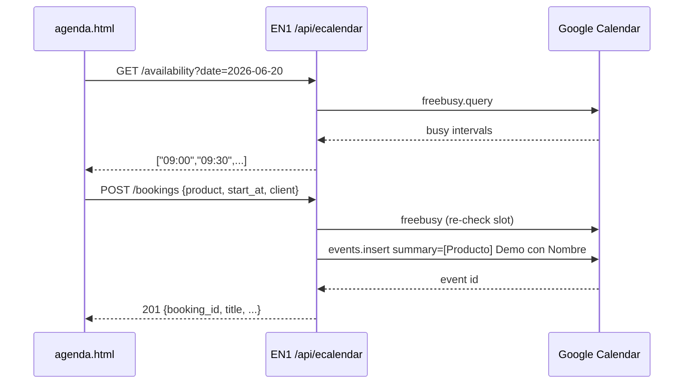

# Instrucción completa — ECalendar V1 en EN1 (appdev → appprd)

**Documento:** guía operativa para el programador EN1 + referencia sitio estático  
**Versión:** 1.0  
**Fecha:** junio 2026  
**Audiencia:** backend EN1, frontend `Site_2026`, operación EasyTech  

---

## Tabla de contenidos

1. [Contexto del proyecto](#1-contexto-del-proyecto)  
2. [Decisiones ya tomadas](#2-decisiones-ya-tomadas)  
3. [Qué NO es este trabajo](#3-qué-no-es-este-trabajo)  
4. [Arquitectura general](#4-arquitectura-general)  
5. [Entornos EN1](#5-entornos-en1)  
6. [Google Cloud y OAuth](#6-google-cloud-y-oauth)  
7. [Especificación API ECalendar](#7-especificación-api-ecalendar)  
8. [Implementación en repo EN1](#8-implementación-en-repo-en1)  
9. [Variables de entorno (appdev / appprd)](#9-variables-de-orno-appdev--appprd)  
10. [CORS y seguridad](#10-cors-y-seguridad)  
11. [Deploy appdev paso a paso](#11-deploy-appdev-paso-a-paso)  
12. [Pruebas en appdev](#12-pruebas-en-appdev)  
13. [Promoción a appprd](#13-promoción-a-appprd)  
14. [Trabajo paralelo en Site_2026](#14-trabajo-paralelo-en-site_2026)  
15. [Checklist final](#15-checklist-final)  
16. [Fuera de alcance V1](#16-fuera-de-alcance-v1)  

**Documentos relacionados:**  
`docs/PROPUESTA_TECNICA_ECALENDAR_V1.md` · `docs/MAPA_CTA.md` · `docs/PROPUESTA_ALINEACION_ECOSYSTEM.md`

---

## 1. Contexto del proyecto

### 1.1 EasyTech hoy

Easy Technology Services opera un **ecosistema comercial** (EasyTech Ecosystem):

- **Sitio vitrina:** [easytech.services](https://easytech.services) — HTML estático en repo `Site_2026`
- **Plataforma central:** EasyNodeOne (EN1) — [appprd.easynodeone.com](https://appprd.easynodeone.com/login)
- **Captación actual:** WhatsApp (+507 6688-4938), email, registro en portales, **Calendly embebido** en `agenda.html`

### 1.2 Problema que resuelve ECalendar

| Hoy (Calendly) | Objetivo (ECalendar V1) |
|----------------|-------------------------|
| iframe externo | Formulario propio en `/agenda` |
| Un tipo de evento genérico | **11 productos** en un `<select>` |
| Título de cita genérico | Título GCal: `[Easy Odoo] Demo con Juan Pérez` |
| Datos en Calendly | **Un solo Google Calendar** (`easytechservices25@gmail.com`) |
| Varios calendarios / URLs por producto | **Una sola URL:** `/agenda` |

### 1.3 Regla de negocio central

```text
Un solo calendario Google para todos los productos.
La diferencia la maneja el FORMULARIO (campo producto) y el TÍTULO del evento.
```

**No crear** en V1:

- `/agenda/easy-odoo`
- `/agenda/en1`
- Múltiples calendarios Google

**Sí permitido:** prellenar producto vía query en la misma URL:

```text
https://easytech.services/agenda?product=easy-odoo
```

### 1.4 Por qué el backend vive en EN1

El sitio `Site_2026` **no tiene servidor**. Google Calendar API exige **client secret** y **refresh token** en servidor. EN1 ya está desplegado (`appprd`) y comparte organización con el ecosistema → la API ECalendar se implementa **como módulo HTTP dentro del backend EN1**.

### 1.5 Flujo comercial del visitante

```text
Cliente entra a /agenda
    → elige fecha y hora (slots libres)
    → completa datos + producto de interés
    → POST a EN1 /api/ecalendar/bookings
    → EN1 crea evento en Google Calendar
    → pantalla de éxito + WhatsApp respaldo
```

Equipo EasyTech filtra citas en **un solo calendario** por prefijo `[Producto]` en el título.

---

## 2. Decisiones ya tomadas

| Tema | Decisión | Estado |
|------|----------|--------|
| Backend | **EN1** (no Apps Script / Worker para V1) | ✅ Aprobado |
| Ruta única agenda | `/agenda` → `agenda.html` | ✅ |
| Calendario Google | **Uno** | ✅ |
| Cuenta Google | **`easytechservices25@gmail.com`** | ✅ |
| WhatsApp oficial | **+507 6688-4938** (`wa.me/50766884938`) | ✅ |
| EN1 producción (login/registro) | `appprd.easynodeone.com` | ✅ Ya en uso |
| Flujo deploy | **appdev primero → luego appprd** | ✅ |
| OAuth client creado | Google Cloud — tipo Web | ✅ (jun 2026) |
| Client ID (público) | `225481606427-74o33l96gscab7qpnja1sssafb13l0sk.apps.googleusercontent.com` | ✅ |
| Client secret | **Solo en variables de entorno del servidor** — rotar si se expuso en chat | ⚠ Acción requerida |

### Pendientes (negocio — no bloquean appdev inicial)

| Tema | Opciones |
|------|----------|
| Duración cita | 30 min todos (recomendado V1) |
| Invitación GCal al email del cliente | Sí (recomendado) / No |
| Apagar Calendly | Paralelo 2 sem / big bang |
| Log DB en EN1 además de GCal | Opcional V1 |

---

## 3. Qué NO es este trabajo

- **No** levantar EN1 desde cero — `appprd` ya corre.
- **No** rediseñar el sitio completo — solo `agenda.html` + JS.
- **No** CRM, IA, múltiples calendarios, slugs por producto.
- **No** poner secretos OAuth en `Site_2026` ni en JavaScript público.
- **No** cambiar CTAs de WhatsApp/email sin actualizar `docs/MAPA_CTA.md`.

---

## 4. Arquitectura general

```text
┌─────────────────────────────────────────────────────────────────┐
│  easytech.services (Site_2026 — estático)                       │
│  agenda.html + assets/js/ecalendar.js                           │
│  - UI: fecha, hora, formulario, select producto                 │
│  - fetch() → API EN1 (nunca llama Google directo)               │
└───────────────────────────┬─────────────────────────────────────┘
                            │ HTTPS JSON
                            ▼
┌─────────────────────────────────────────────────────────────────┐
│  EN1 Backend                                                    │
│  appdev.easynodeone.com  (desarrollo)                           │
│  appprd.easynodeone.com  (producción)                           │
│                                                                 │
│  GET  /api/ecalendar/products                                   │
│  GET  /api/ecalendar/availability?date=YYYY-MM-DD               │
│  POST /api/ecalendar/bookings                                   │
│                                                                 │
│  Env: GOOGLE_* secrets, ECALENDAR_* config                      │
└───────────────────────────┬─────────────────────────────────────┘
                            │ Google Calendar API
                            ▼
┌─────────────────────────────────────────────────────────────────┐
│  Google Calendar (cuenta easytechservices25@gmail.com)          │
│  UN calendario — todos los eventos con [Producto] en título     │
└─────────────────────────────────────────────────────────────────┘
```

### Secuencia reserva



---

## 5. Entornos EN1

| Entorno | URL base (ajustar si difiere en infra) | Uso |
|---------|----------------------------------------|-----|
| **Desarrollo** | `https://appdev.easynodeone.com` | Implementar y probar ECalendar |
| **Producción** | `https://appprd.easynodeone.com` | Tráfico real + sitio easytech.services |

```text
Flujo obligatorio:

  Código en repo EN1
       ↓
  Deploy → appdev
       ↓
  QA (API + agenda apuntando a dev)
       ↓
  Deploy → appprd
       ↓
  agenda.html → URL API prod
       ↓
  Desactivar Calendly
```

**Nota:** Si la URL real de dev no es `appdev.easynodeone.com`, sustituir en variables y CORS; la lógica es la misma.

---

## 6. Google Cloud y OAuth

### 6.1 Checklist Google Cloud Console

- [ ] Proyecto GCP creado (ej. `easytech-ecalendar`)
- [ ] **Google Calendar API** habilitada
- [ ] Pantalla de consentimiento OAuth configurada
- [ ] App en modo **Testing** → agregar **Test user:** `easytechservices25@gmail.com`
- [ ] Cliente OAuth tipo **Aplicación web**
- [ ] Client ID registrado (ver §2)
- [ ] Client secret generado y guardado **solo en servidor** (rotar si hubo fuga)

### 6.2 Scopes

```text
https://www.googleapis.com/auth/calendar.events
```

(o `calendar` si el equipo prefiere scope amplio en V1 — documentar elección)

### 6.3 Obtener refresh token (una vez por entorno)

**Ejecutar en máquina segura**, no commitear resultados.

1. Agregar URI de redirección en OAuth client, ej.:
   - `http://localhost:8080/oauth/callback` (local)
   - `https://appdev.easynodeone.com/oauth/callback` (si EN1 expone callback)

2. Abrir URL de autorización (plantilla):

```text
https://accounts.google.com/o/oauth2/v2/auth?
  client_id=TU_CLIENT_ID.apps.googleusercontent.com&
  redirect_uri=http://localhost:8080/oauth/callback&
  response_type=code&
  scope=https://www.googleapis.com/auth/calendar.events&
  access_type=offline&
  prompt=consent
```

3. Iniciar sesión con **`easytechservices25@gmail.com`**.

4. Intercambiar `code` por tokens (POST a `https://oauth2.googleapis.com/token`).

5. Guardar **`refresh_token`** en secretos de **appdev** (y prod cuando promocionen).

### 6.4 Calendar ID

Opciones:

| Opción | Calendar ID |
|--------|-------------|
| Calendario primario de la cuenta | `easytechservices25@gmail.com` |
| Calendario dedicado “EasyTech Citas” | ID desde GCal → Configuración → Integrar calendario |

**Recomendación V1:** calendario dedicado para no mezclar eventos personales con citas comerciales.

### 6.5 appdev vs appprd — calendario

| Estrategia | Descripción |
|------------|-------------|
| **A (recomendada)** | Calendario de **prueba** en dev; calendario **EasyTech Citas** en prod |
| **B (rápida)** | Mismo calendario en ambos — eventos de prueba con prefijo `[TEST]` |

Documentar cuál elige el equipo en `.env` de cada entorno.

---

## 7. Especificación API ECalendar

**Prefijo base:** `/api/ecalendar`  
**Content-Type:** `application/json`  
**Timezone:** `America/Panama` en todo el stack  

### 7.1 GET `/api/ecalendar/products`

Lista cerrada para el `<select>` del formulario.

**Response 200:**

```json
{
  "products": [
    { "slug": "easy-odoo", "label": "Easy Odoo" },
    { "slug": "facturacion-electronica", "label": "Facturación Electrónica Panamá" },
    { "slug": "easy-converso", "label": "Easy Converso" },
    { "slug": "easynodeone", "label": "EasyNodeOne / EN1" },
    { "slug": "eclassone", "label": "EClassOne" },
    { "slug": "ethesisone", "label": "EThesisOne" },
    { "slug": "eposone", "label": "EPOSOne" },
    { "slug": "epayroll", "label": "EPayRoll" },
    { "slug": "iius", "label": "IIUS" },
    { "slug": "consultoria-ti", "label": "Consultoría TI" },
    { "slug": "desarrollo-software", "label": "Desarrollo de Software" }
  ]
}
```

### 7.2 GET `/api/ecalendar/availability`

**Query:**

| Param | Requerido | Ejemplo |
|-------|-----------|---------|
| `date` | Sí | `2026-06-20` (YYYY-MM-DD) |

**Response 200:**

```json
{
  "date": "2026-06-20",
  "timezone": "America/Panama",
  "slot_duration_minutes": 30,
  "slots": ["09:00", "09:30", "10:00", "10:30"]
}
```

**Reglas de generación de slots (config servidor):**

```yaml
slot_duration_minutes: 30
slot_step_minutes: 30
lead_time_hours: 4
horizon_days: 30
working_hours:
  mon-fri: ["09:00", "17:00"]
  sat-sun: []
buffer_minutes: 0
```

**Errores:**

| Código | Cuándo |
|--------|--------|
| 400 | Fecha inválida o fuera de horizonte |
| 503 | Google API no disponible |

### 7.3 POST `/api/ecalendar/bookings`

**Body:**

```json
{
  "product_slug": "easy-odoo",
  "start_at": "2026-06-20T09:00:00-05:00",
  "client": {
    "full_name": "Juan Pérez",
    "company": "Empresa SA",
    "whatsapp": "+50766881234",
    "email": "juan@empresa.com",
    "notes": "Quiero ver inventario y facturación"
  }
}
```

**Validaciones backend:**

| Campo | Regla |
|-------|-------|
| `product_slug` | Debe existir en catálogo |
| `start_at` | ISO8601, timezone Panama, alineado a slot válido |
| `client.full_name` | Requerido, min 2 chars |
| `client.email` | Requerido, formato email |
| `client.whatsapp` | Requerido |
| `client.company` | Opcional |
| `client.notes` | Opcional, max 2000 chars |

**Lógica:**

1. Resolver `product_label` desde slug.  
2. **Re-consultar freebusy** para `[start_at, start_at + 30min]`.  
3. Si ocupado → **409 Conflict**.  
4. Crear evento GCal:

```text
summary:  [Easy Odoo] Demo con Juan Pérez
description:
  Producto: Easy Odoo (easy-odoo)
  Empresa: Empresa SA
  WhatsApp: +50766881234
  Email: juan@empresa.com
  Comentario: ...
  booking_id: 550e8400-e29b-41d4-a716-446655440000
  Origen: easytech.services/agenda
```

5. Opcional: `attendees: [{ "email": "juan@empresa.com" }]` → invitación GCal.

**Response 201:**

```json
{
  "booking_id": "550e8400-e29b-41d4-a716-446655440000",
  "google_event_id": "abc123",
  "google_event_link": "https://calendar.google.com/calendar/event?eid=...",
  "title": "[Easy Odoo] Demo con Juan Pérez",
  "product_slug": "easy-odoo",
  "product_label": "Easy Odoo",
  "start_at": "2026-06-20T09:00:00-05:00",
  "end_at": "2026-06-20T09:30:00-05:00"
}
```

**Errores:**

| Código | Body ejemplo |
|--------|--------------|
| 400 | `{ "error": "validation", "fields": {...} }` |
| 409 | `{ "error": "slot_unavailable", "message": "Ese horario ya no está disponible" }` |
| 429 | Rate limit |
| 502/503 | Error Google API |

### 7.4 GET `/api/ecalendar/health` (opcional)

```json
{ "status": "ok", "google": "connected", "environment": "development" }
```

Útil para smoke test post-deploy en appdev.

---

## 8. Implementación en repo EN1

> **Este trabajo ocurre en el repositorio backend de EN1**, no en `Site_2026`.

### 8.1 Módulo sugerido (adaptar al stack EN1: Django / FastAPI / Laravel / etc.)

```text
en1/
├── apps/ecalendar/              # o modules/ecalendar/
│   ├── __init__.py
│   ├── config.py                # productos, horarios, env
│   ├── products.py              # catálogo 11 productos
│   ├── availability.py          # slots + freebusy
│   ├── bookings.py              # validación + events.insert
│   ├── google_client.py         # OAuth refresh + Calendar API wrapper
│   ├── serializers.py           # request/response schemas
│   ├── views.py                 # endpoints HTTP
│   ├── urls.py                  # router /api/ecalendar/*
│   └── tests/
│       ├── test_availability.py
│       └── test_bookings.py
├── .env.example                 # plantilla sin secretos
└── docs/ECALENDAR.md            # runbook interno EN1
```

### 8.2 Responsabilidades por archivo

| Módulo | Responsabilidad |
|--------|-----------------|
| `google_client.py` | Refresh access token; `freebusy.query`; `events.insert` |
| `products.py` | Lista slug → label; validar slug en POST |
| `availability.py` | Generar slots; restar busy; lead_time / horizon |
| `bookings.py` | Validar payload; anti doble reserva; armar título `[Producto]` |
| `views.py` | HTTP, CORS headers, rate limit, logging |
| `tests/` | Mock Google API; slot conflict 409 |

### 8.3 Dependencias Google

Usar cliente oficial del lenguaje de EN1, ej.:

- Python: `google-api-python-client`, `google-auth`
- Node: `googleapis`

**No** implementar OAuth manual más allá del refresh token almacenado.

### 8.4 Logging mínimo

Registrar (sin PII excesiva en logs públicos):

- `booking_id`, `product_slug`, `start_at`, resultado HTTP  
- Errores Google API con correlation id  
- **No** loguear `GOOGLE_CLIENT_SECRET` ni `refresh_token`

### 8.5 Tabla opcional `ecalendar_bookings` (EN1 DB)

Si EN1 ya tiene PostgreSQL/MySQL, V1 recomienda tabla simple:

```sql
-- Opcional V1 — auditoría
CREATE TABLE ecalendar_bookings (
  id UUID PRIMARY KEY,
  created_at TIMESTAMPTZ NOT NULL DEFAULT NOW(),
  product_slug VARCHAR(64) NOT NULL,
  product_label VARCHAR(128) NOT NULL,
  start_at TIMESTAMPTZ NOT NULL,
  end_at TIMESTAMPTZ NOT NULL,
  google_event_id VARCHAR(256),
  client_name VARCHAR(256) NOT NULL,
  client_email VARCHAR(256) NOT NULL,
  client_whatsapp VARCHAR(32),
  client_company VARCHAR(256),
  client_notes TEXT,
  source VARCHAR(32) DEFAULT 'easytech.services'
);
```

Si no hay DB lista en appdev, V1 puede vivir **solo con Google Calendar** + logs.

---

## 9. Variables de entorno (appdev / appprd)

**Nunca commitear valores reales.** Solo `.env.example` en repo.

### 9.1 Plantilla `.env.example`

```bash
# === ECalendar V1 ===
ECALENDAR_ENV=development          # development | production
ECALENDAR_TIMEZONE=America/Panama

# Google OAuth (servidor únicamente)
GOOGLE_CLIENT_ID=xxx.apps.googleusercontent.com
GOOGLE_CLIENT_SECRET=              # rotar si se filtró; solo en secret manager
GOOGLE_REFRESH_TOKEN=              # obtener una vez vía OAuth flow
GOOGLE_CALENDAR_ID=                # email del cal o ID dedicado

# Reglas de slots
ECALENDAR_SLOT_MINUTES=30
ECALENDAR_LEAD_TIME_HOURS=4
ECALENDAR_HORIZON_DAYS=30
ECALENDAR_WORK_START=09:00
ECALENDAR_WORK_END=17:00
ECALENDAR_WORK_DAYS=mon,tue,wed,thu,fri

# CORS (orígenes permitidos, separados por coma)
ECALENDAR_CORS_ORIGINS=http://localhost:8080,http://127.0.0.1:5500,https://easytech.services,https://www.easytech.services

# Rate limit (opcional)
ECALENDAR_RATE_LIMIT_PER_MIN=30

# Prefijo título en dev (opcional)
ECALENDAR_TITLE_PREFIX_TEST=[TEST]
```

### 9.2 appdev vs appprd

| Variable | appdev | appprd |
|----------|--------|--------|
| `ECALENDAR_ENV` | `development` | `production` |
| `GOOGLE_CALENDAR_ID` | Calendario prueba o `[TEST]` prefix | Calendario comercial |
| `ECALENDAR_CORS_ORIGINS` | localhost + easytech.services | solo dominios prod |
| OAuth secrets | Mismos o separados por política | Prod en secret manager |

---

## 10. CORS y seguridad

### 10.1 CORS

El browser en `easytech.services/agenda` hará `fetch` cross-origin a `appdev.easynodeone.com`.

Headers requeridos en respuestas EN1:

```http
Access-Control-Allow-Origin: https://easytech.services
Access-Control-Allow-Methods: GET, POST, OPTIONS
Access-Control-Allow-Headers: Content-Type
```

En appdev, incluir también orígenes locales para pruebas.

### 10.2 Rate limiting

- Máx. ~30 requests/min por IP en `/bookings`  
- Evita spam de creación de eventos

### 10.3 Sin autenticación de usuario EN1

V1 es **endpoint público** (como Calendly). La protección es rate limit + validación + re-check slot.

### 10.4 Secretos

| Dónde | Qué |
|-------|-----|
| ✅ Servidor EN1 env / vault | client secret, refresh token |
| ✅ Google Cloud | client ID (público) |
| ❌ Site_2026 JS | cualquier secreto |
| ❌ Git | `.env` con valores reales |

---

## 11. Deploy appdev paso a paso

### Fase 0 — Pre-requisitos

- [ ] Acceso repo EN1 y pipeline deploy **appdev**
- [ ] Google Calendar API habilitada
- [ ] Refresh token obtenido para cuenta `easytechservices25@gmail.com`
- [ ] Calendar ID definido para dev
- [ ] Client secret **rotado** si hubo exposición

### Fase 1 — Código

- [ ] Crear módulo `ecalendar` (§8)
- [ ] Implementar 3 endpoints (§7)
- [ ] Tests unitarios con mock Google
- [ ] `.env.example` documentado
- [ ] Ruta health check

### Fase 2 — Configuración appdev

- [ ] Cargar variables §9 en secretos del entorno **appdev**
- [ ] Verificar conectividad Google desde el servidor (no desde laptop si firewall restringe)

### Fase 3 — Deploy

```text
git checkout -b feature/ecalendar-v1
# ... commits ...
# PR / merge según proceso EN1
deploy → appdev
```

- [ ] Smoke: `GET https://appdev.easynodeone.com/api/ecalendar/health`
- [ ] Smoke: `GET .../products`
- [ ] Smoke: `GET .../availability?date=YYYY-MM-DD`

### Fase 4 — Prueba manual crear evento

```bash
curl -X POST "https://appdev.easynodeone.com/api/ecalendar/bookings" \
  -H "Content-Type: application/json" \
  -d '{
    "product_slug": "easy-odoo",
    "start_at": "2026-06-20T10:00:00-05:00",
    "client": {
      "full_name": "Prueba Dev",
      "company": "EasyTech QA",
      "whatsapp": "+50766884938",
      "email": "easytechservices25@gmail.com",
      "notes": "Test ECalendar appdev"
    }
  }'
```

- [ ] Evento visible en Google Calendar con título `[Easy Odoo] Demo con Prueba Dev` (o `[TEST] ...`)
- [ ] Segundo POST mismo slot → **409**

---

## 12. Pruebas en appdev

### 12.1 Matriz QA backend

| # | Caso | Esperado |
|---|------|----------|
| 1 | availability día laborable | slots 09:00–16:30 cada 30 min |
| 2 | availability sábado | `slots: []` |
| 3 | availability con evento existente | slot ocupado ausente |
| 4 | booking válido | 201 + evento GCal |
| 5 | booking slot ocupado | 409 |
| 6 | product_slug inválido | 400 |
| 7 | email inválido | 400 |
| 8 | fecha pasada | 400 |
| 9 | menos de 4 h lead time | slot no ofrecido / 400 |
| 10 | los 11 productos | título correcto `[Label]` |

### 12.2 Matriz QA integración con sitio

Configurar temporalmente en `Site_2026`:

```javascript
// assets/js/portal-urls.js (solo durante QA)
ecalendarApiBase: "https://appdev.easynodeone.com/api/ecalendar"
```

| # | Caso | Esperado |
|---|------|----------|
| 1 | Abrir agenda.html local o staging | formulario carga productos |
| 2 | Elegir fecha → horas | slots desde API dev |
| 3 | Enviar formulario | éxito + mensaje |
| 4 | `?product=facturacion-electronica` | select prellenado |
| 5 | Error 409 | mensaje “elige otra hora” |
| 6 | API caída | fallback WhatsApp visible |

### 12.3 Operación — filtrar en Google Calendar

En la app móvil/web de `easytechservices25@gmail.com`:

- Buscar `[Easy Odoo]` → solo citas Odoo  
- Buscar `[Facturación` → facturación electrónica  
- Vista semanal → un solo calendario, colores por título

---

## 13. Promoción a appprd

### Cuándo promover

- [ ] Todos los casos §12 pasan en appdev  
- [ ] Product owner aprueba UX en agenda  
- [ ] Calendario prod creado y `GOOGLE_CALENDAR_ID` prod configurado  
- [ ] CORS prod solo dominios finales  

### Pasos

```text
1. Merge feature/ecalendar-v1 → rama release EN1
2. Deploy appprd (mismo artefacto probado en dev)
3. Configurar secretos prod (refresh token / calendar id prod)
4. Smoke tests en appprd (health, products, booking de prueba)
5. Site_2026: ecalendarApiBase → https://appprd.easynodeone.com/api/ecalendar
6. Publicar sitio estático
7. Monitorear 48 h — mantener Calendly como fallback opcional
8. Retirar Calendly de agenda.html cuando estable
```

### Rollback

- Revertir deploy EN1 **o** desactivar rutas `/api/ecalendar`  
- Sitio: restaurar `calendly-config.js` temporalmente  
- Eventos ya creados permanecen en GCal (no destructivo)

---

## 14. Trabajo paralelo en Site_2026

Mientras EN1 desarrolla en appdev, el sitio estático puede avanzar en paralelo:

| Archivo | Acción |
|---------|--------|
| `assets/js/ecalendar-products.js` | Catálogo 11 productos + templates WhatsApp |
| `assets/js/ecalendar.js` | UI wizard; `fetch(ECALENDAR_API_BASE + '/availability')` |
| `agenda.html` | Reemplazar bloque Calendly por contenedor `#ecalendar-app` |
| `assets/js/portal-urls.js` | `ecalendarApiBaseDev` / `ecalendarApiBaseProd` |
| `assets/js/main.js` | Eliminar `initScheduleEmbed` Calendly |
| `assets/js/calendly-config.js` | Deprecar tras prod |
| `docs/MAPA_CTA.md` | Actualizar canal Agenda post-go-live |

**Ejemplo portal-urls.js (futuro):**

```javascript
window.EASYTECH_PORTAL_URLS = {
  // ... existentes ...
  ecalendarApiBase: "https://appdev.easynodeone.com/api/ecalendar", // QA
  // ecalendarApiBase: "https://appprd.easynodeone.com/api/ecalendar", // prod
};
```

**WhatsApp respaldo tras reserva (plantilla):**

```text
https://wa.me/50766884938?text=Reservé%20cita%20EasyTech%20-%20{producto}%20-%20{fecha}%20{hora}
```

---

## 15. Checklist final

### Backend EN1 (appdev)

- [ ] Módulo ecalendar desplegado en appdev  
- [ ] OAuth refresh funciona  
- [ ] 3 endpoints operativos  
- [ ] CORS configurado  
- [ ] Rate limit activo  
- [ ] Tests pasan  
- [ ] Evento prueba en GCal  

### Sitio (Site_2026)

- [ ] agenda.html usa ECalendar JS  
- [ ] Apunta a API appdev (QA) luego appprd  
- [ ] 11 productos en select  
- [ ] `?product=` prellena  
- [ ] Pantalla éxito + WhatsApp  
- [ ] Calendly removido en prod  

### Negocio

- [ ] Calendario único operativo  
- [ ] Equipo sabe filtrar por `[Producto]`  
- [ ] Calendly dado de baja  
- [ ] MAPA_CTA actualizado  

---

## 16. Fuera de alcance V1

- `/agenda/{producto}` múltiples URLs  
- Múltiples calendarios Google  
- CRM / sync leads EN1  
- IA comercial  
- Cancelación self-service  
- Google Meet automático  
- Admin UI EasyTech  
- Duración distinta por producto  

---

## Resumen ejecutivo para el programador EN1

```text
1. Implementá /api/ecalendar/* en el backend EN1.
2. Usá OAuth refresh de easytechservices25@gmail.com + UN calendar_id.
3. GET availability genera slots; POST bookings crea evento [Producto] Demo con Nombre.
4. Deploy primero en appdev; probá con curl y con agenda.html apuntando a dev.
5. Cuando QA pase → deploy appprd → sitio apunta a prod → apagar Calendly.
6. Secretos NUNCA en Site_2026 ni en git.
```

**Contacto captación (referencia):**  
- Email: `easytechservices25@gmail.com`  
- WhatsApp: `+507 6688-4938`  

---

*Fin del documento — ECalendar V1 EN1 appdev*
