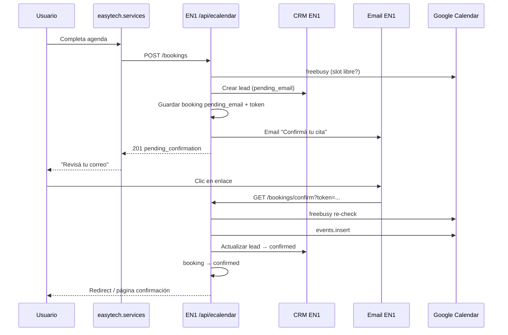

# Instrucción completa — ECalendar V2 en EN1 (confirmación email + CRM lead)

**Documento:** especificación para programador backend EN1  
**Versión:** 2.0  
**Fecha:** junio 2026  
**Audiencia:** backend EN1 · referencia frontend `Site_2026`  
**Reemplaza parcialmente:** flujo inmediato de `POST /bookings` en `INSTRUCCION_ECALENDAR_EN1_APPDEV.md` (V1 §7.3)

**Documentos relacionados:**  
`docs/INSTRUCCION_ECALENDAR_EN1_APPDEV.md` · `docs/PROPUESTA_TECNICA_ECALENDAR_V1.md` · `docs/ECALENDAR_QA_CHECKLIST.md` (crear en EN1 si no existe)

---

## 1. Objetivo V2

Al recibir una solicitud desde `https://easytech.services/agenda.html`:

1. **Validar** datos y disponibilidad del slot (Google Calendar freebusy).
2. **Crear lead en CRM** de EN1 (estado inicial: pendiente de confirmación).
3. **Guardar booking** en estado `pending_email` (sin evento definitivo en GCal, o evento tentativo opcional).
4. **Enviar correo** al visitante con enlace único para confirmar email y cita.
5. **Solo al confirmar** el enlace → marcar lead/cita como confirmados → **crear evento en Google Calendar**.

**Fuera de alcance V2:** rediseño del sitio, OAuth en frontend, múltiples calendarios, rutas `/agenda/{producto}`.

---

## 2. Estado actual (jun 2026)

### 2.1 Sitio `Site_2026` (ya desplegado / en repo)

| Ítem | Estado |
|------|--------|
| `agenda.html` + `ecalendar.js` | UI booking 2 columnas, móvil |
| API base DEV | `https://appdev.easynodeone.com/api/ecalendar` |
| `mockMode` | `false` en `ecalendar-config.js` |
| Endpoints usados | `GET /products`, `GET /availability`, `POST /bookings` |
| Captcha Turnstile | En formulario (validación server-side **pendiente** en EN1) |
| Pantalla éxito actual | Muestra «cita confirmada» — **cambiará** a «revisá tu correo» cuando V2 esté listo |

### 2.2 Payload actual del landing (`POST /bookings`)

```json
{
  "product_id": "easy_odoo",
  "slot_start": "2026-06-18T15:00:00-05:00",
  "name": "Juan Pérez",
  "email": "juan@empresa.com",
  "phone": "+50760000000",
  "company": "ACME SA",
  "notes": "Opcional"
}
```

**Mantener compatibilidad** con este contrato. Opcional: aceptar también el formato V1 anidado (`product_slug`, `start_at`, `client{...}`) durante transición.

### 2.3 Google / OAuth

- Cuenta calendario: `easytechservices25@gmail.com`
- OAuth solo en servidor EN1 (refresh token en variables de entorno).
- Pantalla consentimiento OAuth: home `https://easytech.services/` · privacidad/terminos en sitio.

---

## 3. Flujo de negocio V2



### 3.1 Estados del booking

| Estado | Descripción | GCal | CRM lead |
|--------|-------------|------|----------|
| `pending_email` | Solicitud creada; esperando clic en email | No (o tentativo opcional) | `pending_confirmation` |
| `confirmed` | Email verificado; cita firme | Sí — evento creado | `confirmed` / `qualified` |
| `expired` | Token venció sin confirmar | No | `expired` o `lost` |
| `cancelled` | Cancelado por usuario u operación | Eliminar evento si existía | `cancelled` |
| `slot_unavailable` | Al confirmar, slot ya no libre | No | `needs_reschedule` |

### 3.2 Regla de slot durante `pending_email`

- El slot **debe considerarse ocupado** en `GET /availability` mientras exista un booking `pending_email` vigente para ese `slot_start` (evita doble reserva).
- TTL del hold: **`ECALENDAR_CONFIRM_TTL_HOURS`** (default **24**).
- Al expirar → job/cron marca `expired` y libera el slot.

---

## 4. API — endpoints

Base URL:

| Entorno | Base |
|---------|------|
| DEV | `https://appdev.easynodeone.com/api/ecalendar` |
| PRD | `https://appprd.easynodeone.com/api/ecalendar` |

### 4.1 GET `/health`

```json
{
  "ok": true,
  "enabled": true,
  "oauth_valid": true,
  "google_connected": true,
  "calendar_id": "primary",
  "products": 11
}
```

### 4.2 GET `/products`

```json
{
  "ok": true,
  "products": [
    { "id": "easy_odoo", "name": "Easy Odoo" },
    { "id": "easynodeone", "name": "EasyNodeOne / EN1" }
  ]
}
```

IDs con **guion bajo** (`easy_odoo`), alineados al catálogo comercial EasyTech.

### 4.3 GET `/availability?date=YYYY-MM-DD`

**Reglas:** Lun–Vie 09:00–17:00 · slots 30 min · lead 4 h · timezone `America/Panama`.

```json
{
  "ok": true,
  "date": "2026-06-18",
  "timezone": "America/Panama",
  "slots": [
    {
      "start": "2026-06-18T09:00:00-05:00",
      "end": "2026-06-18T09:30:00-05:00"
    }
  ]
}
```

- Excluir slots **busy** en Google Calendar (freebusy).
- Excluir slots con booking `pending_email` no expirado o `confirmed`.
- Sábado/domingo → `slots: []`.
- Fecha pasada → HTTP **400** `{ "ok": false, "error": "past_date" }`.

### 4.4 POST `/bookings` — solicitud (V2)

**Headers:** `Content-Type: application/json`

**Body (contrato landing):**

```json
{
  "product_id": "easy_odoo",
  "slot_start": "2026-06-18T15:00:00-05:00",
  "name": "Juan Pérez",
  "email": "juan@empresa.com",
  "phone": "+50760000000",
  "company": "ACME SA",
  "notes": "Quiero ver inventario"
}
```

**Validaciones:**

| Campo | Regla |
|-------|-------|
| `product_id` | Existe en catálogo |
| `slot_start` | ISO8601 con offset Panama; alineado a slot de 30 min; dentro de horario y horizonte |
| `name` | Requerido, min 2 caracteres |
| `email` | Requerido, formato válido, normalizar lowercase |
| `phone` | Requerido |
| `company`, `notes` | Opcionales |
| `captcha_token` | Opcional en body; **recomendado validar Turnstile** cuando el sitio lo envíe |

**Lógica servidor (orden estricto):**

1. Rate limit por IP.
2. Validar payload.
3. `freebusy` para `[slot_start, slot_start + 30min]`.
4. Si ocupado → **409** `slot_unavailable`.
5. Crear registro `ecalendar_bookings` → `status = pending_email`.
6. Generar `confirmation_token` (UUID v4 o token firmado HMAC, un solo uso).
7. **`crm_create_lead_from_booking(booking)`** → guardar `crm_lead_id` en booking.
8. Enviar email con enlace de confirmación.
9. Responder **201** (no crear evento GCal aún).

**Response 201:**

```json
{
  "ok": true,
  "status": "pending_confirmation",
  "booking_id": "550e8400-e29b-41d4-a716-446655440000",
  "message": "Te enviamos un correo para confirmar tu cita.",
  "confirm_expires_at": "2026-06-19T15:00:00-05:00",
  "crm_lead_id": "lead_abc123"
}
```

**Errores:**

| HTTP | `error` | Cuándo |
|------|---------|--------|
| 400 | `validation` | Campos inválidos |
| 400 | `invalid_email` | Email mal formado |
| 400 | `invalid_slot` | Slot fuera de reglas |
| 409 | `slot_unavailable` | Ocupado en GCal o hold pendiente |
| 429 | `rate_limited` | Demasiados intentos |
| 503 | `google_unavailable` | Fallo Google API |

### 4.5 GET `/bookings/confirm`

Confirmación por enlace del correo.

**Query:**

| Param | Requerido |
|-------|-----------|
| `token` | Sí |

**Lógica:**

1. Buscar booking por token; si no existe → **404** `invalid_token`.
2. Si ya `confirmed` → **200** redirect a URL éxito (idempotente).
3. Si `expired` → **410** `token_expired`.
4. Re-check `freebusy` del slot.
5. Si ocupado → marcar booking `slot_unavailable`, actualizar CRM → página «elegí otro horario».
6. Crear evento Google Calendar (ver §6).
7. Actualizar booking → `confirmed`, guardar `google_event_id`.
8. Actualizar CRM lead → `confirmed`.
9. Enviar email opcional «Cita confirmada» con detalles.
10. Redirect a:  
    `https://easytech.services/agenda.html?confirmed=1&booking_id={id}`  
    o página HTML servida por EN1.

**Response 302** (recomendado) o **200 JSON** si el sitio confirma vía fetch:

```json
{
  "ok": true,
  "status": "confirmed",
  "booking_id": "550e8400-e29b-41d4-a716-446655440000",
  "title": "[Easy Odoo] Demo con Juan Pérez",
  "slot_start": "2026-06-18T15:00:00-05:00",
  "slot_end": "2026-06-18T15:30:00-05:00",
  "google_event_link": "https://calendar.google.com/..."
}
```

### 4.6 POST `/bookings/resend-confirmation` (opcional V2.1)

```json
{ "booking_id": "...", "email": "juan@empresa.com" }
```

- Solo si `pending_email` y no expirado.
- Rate limit estricto (ej. 1 cada 5 min por booking).

---

## 5. Integración CRM EN1

### 5.1 Cuándo crear el lead

**En `POST /bookings`**, inmediatamente después de validar el slot y **antes** de enviar el email.

No esperar a la confirmación del correo para crear el lead — el equipo comercial debe ver la solicitud entrante aunque el usuario no confirme.

### 5.2 Campos mínimos del lead

Adaptar a la tabla/servicio CRM existente en EN1 (`leads`, `crm_leads`, `contacts`, etc.):

| Campo CRM | Origen booking | Ejemplo |
|-----------|----------------|---------|
| `source` | constante | `easytech.services/agenda` |
| `source_detail` | constante | `ECalendar V2` |
| `status` | inicial | `pending_confirmation` |
| `full_name` | `name` | Juan Pérez |
| `email` | `email` | juan@empresa.com |
| `phone` | `phone` | +50760000000 |
| `company` | `company` | ACME SA |
| `product_interest` | resolver `product_id` → label | Easy Odoo |
| `product_id` | `product_id` | easy_odoo |
| `notes` | `notes` + metadata | Comentario usuario |
| `requested_slot_start` | `slot_start` | ISO8601 |
| `booking_id` | UUID interno | enlace 1:1 |
| `organization_id` | config | org EasyTech comercial |
| `assigned_to` | regla EN1 | cola ventas / round-robin / null |

**Metadata sugerida en `notes` o JSON `extra`:**

```json
{
  "booking_id": "550e8400-e29b-41d4-a716-446655440000",
  "slot_start": "2026-06-18T15:00:00-05:00",
  "utm": null,
  "ip_hash": "sha256...",
  "user_agent": "..."
}
```

### 5.3 Actualizaciones CRM por estado

| Evento booking | Acción CRM |
|----------------|------------|
| `POST /bookings` OK | Crear lead `pending_confirmation` |
| `GET /confirm` OK | Lead → `confirmed` o `meeting_scheduled`; guardar `google_event_link` |
| Token expirado | Lead → `expired` o `no_response` |
| Confirmación falla slot | Lead → `needs_reschedule` + nota |
| Cancelación manual | Lead → `cancelled` |

### 5.4 Función interna sugerida

```python
def crm_create_lead_from_booking(booking) -> str:
    """Retorna crm_lead_id. No duplicar si retry idempotente con mismo booking_id."""
    ...

def crm_update_lead_status(crm_lead_id, status, **kwargs) -> None:
    ...
```

**Idempotencia:** si `POST /bookings` se reintenta con mismo email+slot en ventana corta, devolver mismo `booking_id` o 409 según política EN1.

### 5.5 Fuera de alcance CRM V2

- Pipeline completo cotización → factura.
- Sincronización bidireccional GCal ↔ CRM más allá del evento de confirmación.
- Easy Converso / WhatsApp automation (fase posterior).

---

## 6. Google Calendar — solo al confirmar

### 6.1 Título del evento

```text
[Easy Odoo] Demo con Juan Pérez
```

En **appdev**, prefijo opcional: `[TEST]`.

### 6.2 Descripción

```text
Producto: Easy Odoo (easy_odoo)
Empresa: ACME SA
Teléfono: +50760000000
Email: juan@empresa.com
Comentario: ...
booking_id: 550e8400-e29b-41d4-a716-446655440000
crm_lead_id: lead_abc123
Origen: easytech.services/agenda
Estado: confirmed
```

### 6.3 Asistente

Recomendado: `attendees: [{ "email": "juan@empresa.com" }]` para que GCal envíe invitación al cliente **tras confirmar**.

### 6.4 Calendario

- `GOOGLE_CALENDAR_ID=primary` o email `easytechservices25@gmail.com`.
- Un solo calendario para todos los productos.

---

## 7. Email transaccional

### 7.1 Proveedor

Usar el **módulo de email ya existente en EN1** (SMTP, SendGrid, Gmail API, etc.). No implementar SMTP nuevo si EN1 ya envía correos.

### 7.2 Correo «Confirmá tu cita» (al POST)

**Asunto:** `Confirmá tu cita con EasyTech — {fecha} {hora}`

**Cuerpo (resumen):**

```text
Hola {name},

Recibimos tu solicitud de cita para conocer {product_label}.

Fecha: {fecha legible}
Hora: {hora} (Panamá)
Duración: 30 minutos

Para confirmar tu correo y reservar el horario, hacé clic en el siguiente enlace
(válido por 24 horas):

{confirm_url}

Si no solicitaste esta cita, ignorá este mensaje.

Easy Technology Services · EasyTech Ecosystem
https://easytech.services
```

**URL de confirmación:**

```text
https://appdev.easynodeone.com/api/ecalendar/bookings/confirm?token={confirmation_token}
```

En producción usar **appprd** o dominio API público acordado. El redirect final debe llevar a `easytech.services`.

### 7.3 Correo «Cita confirmada» (opcional, tras GET confirm)

Incluir `.ics` opcional o link a Google Calendar event.

---

## 8. Base de datos EN1

### 8.1 Tabla `ecalendar_bookings`

```sql
CREATE TABLE ecalendar_bookings (
  id UUID PRIMARY KEY,
  created_at TIMESTAMPTZ NOT NULL DEFAULT NOW(),
  updated_at TIMESTAMPTZ NOT NULL DEFAULT NOW(),

  status VARCHAR(32) NOT NULL DEFAULT 'pending_email',
  -- pending_email | confirmed | expired | cancelled | slot_unavailable

  product_id VARCHAR(64) NOT NULL,
  product_label VARCHAR(128) NOT NULL,
  slot_start TIMESTAMPTZ NOT NULL,
  slot_end TIMESTAMPTZ NOT NULL,

  client_name VARCHAR(256) NOT NULL,
  client_email VARCHAR(256) NOT NULL,
  client_phone VARCHAR(32) NOT NULL,
  client_company VARCHAR(256),
  client_notes TEXT,

  confirmation_token VARCHAR(128) NOT NULL UNIQUE,
  confirm_expires_at TIMESTAMPTZ NOT NULL,
  confirmed_at TIMESTAMPTZ,

  google_event_id VARCHAR(256),
  google_event_link TEXT,

  crm_lead_id VARCHAR(64),

  source VARCHAR(64) DEFAULT 'easytech.services/agenda',
  ip_hash VARCHAR(64),
  user_agent TEXT
);

CREATE INDEX idx_ecalendar_bookings_slot_status
  ON ecalendar_bookings (slot_start, status);

CREATE INDEX idx_ecalendar_bookings_token
  ON ecalendar_bookings (confirmation_token);

CREATE INDEX idx_ecalendar_bookings_email_created
  ON ecalendar_bookings (client_email, created_at DESC);
```

### 8.2 Job de expiración

Cron cada 15 min:

```sql
UPDATE ecalendar_bookings
SET status = 'expired', updated_at = NOW()
WHERE status = 'pending_email'
  AND confirm_expires_at < NOW();
```

Actualizar CRM leads asociados → `expired`.

---

## 9. Seguridad y abuso

| Medida | Implementación |
|--------|----------------|
| CORS | Solo `https://easytech.services`, `https://www.easytech.services`, localhost dev |
| Rate limit | `POST /bookings`: 5/h por IP · `GET /confirm`: 20/h por IP |
| Turnstile | Validar `captcha_token` en POST cuando el sitio lo envíe |
| Token confirmación | UUID aleatorio ≥ 128 bits o JWT firmado, un solo uso |
| No enumerar emails | Respuesta genérica en errores |
| Secretos | OAuth solo en env EN1; rotar si se filtró |
| Logs | Sin PII completa en logs públicos |

---

## 10. Variables de entorno (añadir a V1)

```bash
# Confirmación email
ECALENDAR_CONFIRM_TTL_HOURS=24
ECALENDAR_CONFIRM_BASE_URL=https://appdev.easynodeone.com/api/ecalendar/bookings/confirm
ECALENDAR_SUCCESS_REDIRECT=https://easytech.services/agenda.html

# Email
ECALENDAR_FROM_EMAIL=noreply@easytech.services
ECALENDAR_FROM_NAME=EasyTech

# CRM
ECALENDAR_CRM_ENABLED=true
ECALENDAR_CRM_DEFAULT_ORG_ID=...
ECALENDAR_CRM_LEAD_SOURCE=agenda_ecalendar

# Turnstile (validar captcha del sitio)
TURNSTILE_SECRET_KEY=...

# Slots (heredado V1)
ECALENDAR_SLOT_MINUTES=30
ECALENDAR_LEAD_TIME_HOURS=4
ECALENDAR_HORIZON_DAYS=30
```

---

## 11. Cambios esperados en Site_2026 (después de V2 EN1)

El equipo web ajustará cuando EN1 despliegue V2:

| Cambio | Detalle |
|--------|---------|
| Pantalla post-submit | «Revisá tu correo» en lugar de «Cita confirmada» |
| Query `?confirmed=1` | Pantalla éxito definitiva tras redirect del email |
| Opcional | Enviar `captcha_token` en POST cuando EN1 lo valide |
| `mockMode` | Mantener `false` apuntando a appdev/appprd |

**No requiere cambios en:** OAuth, client secret, refresh token en el HTML.

---

## 12. Pruebas QA (checklist)

| # | Caso | Resultado esperado |
|---|------|-------------------|
| 1 | `GET /health` | `oauth_valid: true` |
| 2 | `GET /products` | 11 productos |
| 3 | `GET /availability` día laborable | Solo slots libres (sin mañana ocupada en GCal) |
| 4 | `POST /bookings` válido | 201 `pending_confirmation` + email enviado + lead CRM |
| 5 | CRM tras POST | Lead existe con `pending_confirmation` |
| 6 | Clic enlace confirmación | booking `confirmed` + evento GCal + lead actualizado |
| 7 | `GET /availability` mismo slot tras POST pendiente | Slot **no** listado |
| 8 | Confirmar después de expirar | 410 `token_expired` |
| 9 | Doble clic mismo token | 200 idempotente, un solo evento GCal |
| 10 | `POST` mismo slot dos emails | Segundo → 409 |
| 11 | Confirmar cuando GCal ya ocupó | `slot_unavailable` + CRM `needs_reschedule` |
| 12 | Rate limit | 429 tras abuso |
| 13 | CORS desde easytech.services | Headers correctos |
| 14 | Incógnito sin login | Todo el flujo público funciona |

---

## 13. Deploy

1. Implementar en **appdev**.
2. Smoke tests §12.
3. Avisar a web para cambiar pantalla «revisá tu correo».
4. QA conjunto con `easytech.services/agenda.html`.
5. Promover a **appprd** tras GO explícito.

---

## 14. Criterio de «listo» V2

- [ ] Solicitud desde agenda crea **lead CRM** + booking `pending_email`.
- [ ] Email de confirmación enviado con enlace válido 24 h.
- [ ] Al confirmar → evento en **Google Calendar** + lead `confirmed`.
- [ ] Slots pendientes no se ofrecen a otros usuarios.
- [ ] Sitio muestra mensaje correcto según `status` de respuesta.
- [ ] Documentado en runbook interno EN1.

---

## 15. Fuera de alcance V2

- CRM avanzado (pipeline, cotizaciones, facturación).
- Recordatorios SMS/WhatsApp automáticos (fase posterior con Easy Converso).
- Múltiples calendarios por producto.
- Admin UI nueva en EN1 (usar CRM + GCal existentes).

---

*Fin del documento — ECalendar V2 EN1 (CRM + confirmación email)*
