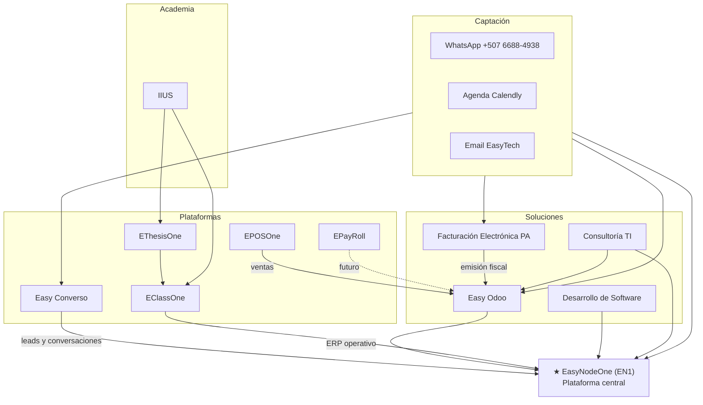

# Propuesta de alineación — EasyTech Ecosystem

**Documento:** Fase de Alineación Landing EasyTech  
**Versión:** 1.0 — propuesta para validación  
**Fecha:** junio 2026  
**Sitio:** [easytech.services](https://easytech.services)  
**Alcance:** estrategia y arquitectura comercial — **sin implementación de código en esta fase**

---

## Propósito

Este documento traduce la **Instrucción Oficial — Fase de Alineación** en una propuesta concreta de navegación, Home, relaciones entre productos y recomendaciones de contenido.

**Objetivo:** pasar de *“un conjunto de páginas y productos”* a *“un ecosistema empresarial integrado”*, donde el visitante entienda en segundos:

1. Qué es EasyTech.  
2. Qué plataformas posee.  
3. Qué soluciones ofrece.  
4. Cómo puede convertirse en cliente.

**Restricciones respetadas en esta fase:** no se programan funcionalidades nuevas, no se rediseña el stack, no se modifican CTAs productivos sin aprobación explícita, no se inicia IA comercial.

---

## Estado actual del sitio (inventario)

| Activo | Estado | Observación |
|--------|--------|-------------|
| `index.html` | Parcialmente alineado | Hero “EasyTech Ecosystem”, catálogo `#ecosistema` por categorías, CTA global `#cta` |
| Header / Footer compartidos | Implementado | Partials + `inline-chrome.py` |
| `soluciones.html` | Easy Odoo | ERP + módulos Odoo detallados |
| `facturacion-electronica.html` | Publicada | Prioridad comercial 2 |
| `econverso.html` | Publicada | Producto oficial en producción |
| `easynodeone.html` | Publicada | EN1 producción (`appprd.easynodeone.com`) |
| `eclassone.html`, `ethesisone.html`, `eposone.html` | Plantilla + flyer | Captación demo |
| `epayroll.html` | Plantilla | Badge “Próximamente” |
| `desarrollo-software.html`, `consultoria-ti.html` | Plantilla | Hoy bajo menú “Servicios” |
| `agenda.html` | Activa | Calendly embebido + fallback |
| `contacto.html` | Duplica bloques del Home | Hub de captación incompleto |
| Flyers numerados | Copiados | `assets/images/flyers/` desde lámina Productos |
| CTAs | Definidos | Ver `docs/MAPA_CTA.md` — **no tocar sin aprobación** |

### Brecha principal vs visión oficial

| Tema | Sitio hoy | Visión oficial (validar) |
|------|-----------|---------------------------|
| Pilares del ecosistema | Plataformas · Soluciones · Servicios profesionales | Plataformas · Soluciones · **Academia** · Captación |
| Desarrollo / Consultoría | Menú “Servicios profesionales” | Listados bajo **Soluciones** |
| EClassOne / EThesisOne | Menú “Plataformas” | Posible rol **Academia** (reclasificar narrativa) |
| IIUS | No presente | Pilar **Academia** explícito — **requiere decisión de alcance** |
| EN1 como plataforma central | Primero en mega menú; hero visual aún Odoo | EN1 debe **liderar** narrativa visual y copy del Home |
| Easy Converso | Visible en catálogo y pills | Debe sentirse **producto principal**, no página secundaria |
| Facturación electrónica | En Home y menú | Correcto en dirección; subir **jerarquía visual** junto a Easy Odoo |

---

## 1. Mockup de navegación final (propuesto)

### Barra principal — desktop

```text
┌──────────────────────────────────────────────────────────────────────────────────────┐
│ [Logo EasyTech.services]                                                             │
│                                                                                      │
│  Plataformas ▼   Soluciones ▼   Academia ▼   Contacto ▼    [Entrar EN1] [Agendar]   │
└──────────────────────────────────────────────────────────────────────────────────────┘
```

### Dropdown — Plataformas

Orden comercial con **EN1 destacado** (tipografía o badge “Plataforma central”):

```text
Plataformas ▼
├── ★ EasyNodeOne (EN1)     — Plataforma empresarial central
├──   Easy Converso         — WhatsApp, flujos y automatización  [EN PRODUCCIÓN]
├──   EClassOne             — Formación en línea
├──   EThesisOne            — Tesis y documentos académicos
├──   EPOSOne               — Punto de venta
└──   EPayRoll              — Nómina · Próximamente
```

### Dropdown — Soluciones

Prioridad comercial inmediata arriba:

```text
Soluciones ▼
├── Easy Odoo                    — ERP e implementación
├── Facturación Electrónica PA   — Cumplimiento fiscal Panamá
├── Desarrollo de Software       — Integraciones y portales a medida
└── Consultoría TI               — Diagnóstico e implementación
```

### Dropdown — Academia

```text
Academia ▼
├── IIUS                         — [URL / página a definir — ver decisión §6]
├── EClassOne                    — Cursos y capacitación en línea
└── EThesisOne                   — Tesis y documentos académicos
```

> **Nota:** Si IIUS vive fuera de `easytech.services`, el ítem puede ser enlace externo con `rel="noopener"` o landing puente en EasyTech que explique la relación sin mezclar marcas.

### Dropdown — Contacto

Sin formularios HTML; captación existente:

```text
Contacto ▼
├── Agendar cita          → agenda.html
├── WhatsApp              → wa.me/50766884938
├── Correo                → mailto:easytechservices25@gmail.com
└── Hablar con el equipo  → contacto.html
```

### Accesos rápidos header (derecha)

| Elemento | Destino | Rol |
|----------|---------|-----|
| **Entrar** | `appprd.easynodeone.com/login` | Usuarios EN1 existentes |
| **Registrarse** | `appprd.easynodeone.com/register` | Self-service EN1 |
| **Agendar cita** | `agenda.html` | CTA comercial principal del sitio |

### Footer (columnas alineadas al menú)

```text
EasyTech Services
email · +507 6688-4938 (WhatsApp)

Soluciones          Plataformas         Academia           Contacto
Easy Odoo           EasyNodeOne ★       IIUS               Agendar
Facturación PA      Easy Converso       EClassOne          WhatsApp
Desarrollo SW       EClassOne*          EThesisOne         Contacto
Consultoría TI      EThesisOne*
                    EPOSOne
                    EPayRoll

* Si EClassOne/EThesisOne quedan solo en Academia en menú, repetir en footer
  la URL más relevante o unificar copy “ver Academia”.
```

---

## 2. Estructura del Home (propuesta)

Narrativa vertical: **identidad → prueba → ecosistema → camino comercial → captación**.

### Orden de secciones y jerarquía

| # | Sección | Objetivo comercial | Prioridad visual |
|---|---------|-------------------|------------------|
| 1 | **Hero — EasyTech Ecosystem** | Qué es EasyTech en una frase; EN1 + Converso + soluciones top | ★★★★★ |
| 2 | **Prueba social / capturas** | Demo visual de 3 líneas: Easy Odoo · Easy Converso · **EasyNodeOne (EN1)** | ★★★★☆ |
| 3 | **Plataformas** | EN1 como hub; Converso como producto estrella SaaS | ★★★★★ |
| 4 | **Soluciones** | Easy Odoo + **Facturación Electrónica** en primera fila | ★★★★★ |
| 5 | **Academia** | IIUS + EClassOne + EThesisOne (bloque institucional) | ★★★☆☆ |
| 6 | **Cómo se conecta** | Diagrama relacional (ver §4) — “una historia, no un catálogo” | ★★★★☆ |
| 7 | **Implementación en 30 días** | Roadmap por fases (solución → plataforma → adopción) | ★★★☆☆ |
| 8 | **Para cada etapa** | Startups · PYMES · Multi-sede | ★★☆☆☆ |
| 9 | **Captación `#cta`** | Agenda · WhatsApp · Contacto — **sin cambiar URLs actuales** | ★★★★★ |

### Hero propuesto (copy orientativo)

```text
H1: EasyTech Ecosystem
Sub: La plataforma empresarial EasyNodeOne conecta operación, ventas,
     automatización y soluciones para empresas en Panamá.

CTA primario:  Agendar demo
CTA secundario: Explorar ecosistema

Pills (orden comercial):
  EasyNodeOne · Easy Converso · Facturación PA · Easy Odoo
```

**Cambio clave vs Home actual:** el visual del hero debería **liderar con EN1** (flyer o captura del portal), no solo tableros Odoo. Odoo pasa a prueba dentro de “Soluciones”.

### Sección Plataformas (Home)

- **Tarjeta destacada (2 columnas):** EasyNodeOne — copy de plataforma central.  
- **Grid secundario:** Easy Converso (badge “En producción”), EClassOne, EThesisOne, EPOSOne, EPayRoll (próximamente).

### Sección Soluciones (Home)

- **Fila hero comercial:** Easy Odoo | Facturación Electrónica Panamá (mismo peso visual).  
- **Fila servicios:** Desarrollo de Software | Consultoría TI.

### Sección Academia (Home) — nueva narrativa

- Bloque intro: formación e institucional.  
- Tarjetas: IIUS · EClassOne · EThesisOne.  
- Sin competir visualmente con Facturación / EN1 / Converso en above-the-fold.

---

## 3. Relación entre productos

### Rol de cada línea en el ecosistema

| Producto | Rol en la historia | Se conecta con… |
|----------|-------------------|-----------------|
| **EasyNodeOne (EN1)** | **Plataforma central** — servicios, clientes, citas, membresías, email, operación multi-org | Converso (leads/comunicación), Easy Odoo (back-office), Facturación (emisión), EPOSOne (ventas), EClassOne/EThesisOne (experiencias formativas) |
| **Easy Converso** | **Canal de captación y automatización** — WhatsApp, flujos, CRM conversacional | EN1 (citas y servicios), Easy Odoo (pedidos/facturas), Facturación (consultas comerciales) |
| **Easy Odoo** | **Núcleo ERP** — ventas, inventario, tesorería, proyectos | Facturación PA, EPOSOne, EPayRoll; implementado con Consultoría / Desarrollo |
| **Facturación Electrónica PA** | **Solución de cumplimiento** — alta conversión comercial inmediata | Easy Odoo (origen de facturas), EN1 (servicios de implementación) |
| **EClassOne** | Academia / capacitación en línea | EN1 (membresías, citas), IIUS (oferta institucional) |
| **EThesisOne** | Academia / documentos académicos | EClassOne, IIUS |
| **EPOSOne** | Punto de venta | Easy Odoo inventario y facturación |
| **EPayRoll** | Planilla (futuro) | Easy Odoo RR.HH. / contabilidad |
| **Desarrollo de Software** | Solución profesional — integraciones y custom | Todo el stack EasyTech |
| **Consultoría TI** | Solución profesional — diagnóstico e implementación | Easy Odoo, EN1, migraciones |
| **IIUS** | Academia institucional | EClassOne, EThesisOne; **alcance web por definir** |

### Flujo comercial típico (visitante → cliente)

```text
Descubrimiento (Home / SEO / WhatsApp)
        ↓
   ¿Necesidad inmediata?
        ├── Facturación / ERP → Soluciones → WhatsApp o Agenda
        ├── Automatización WA → Easy Converso → Registro demo
        ├── Operación / servicios → EasyNodeOne → Registro EN1
        └── Formación → Academia → Demo / contacto
        ↓
   Implementación (Consultoría / Desarrollo) cuando aplica
        ↓
   Operación integrada sobre EN1 + soluciones conectadas
```

---

## 4. Mapa visual del ecosistema

### Vista hub-and-spoke (EN1 al centro)



### Vista por capas (storytelling del Home)

```text
                    ┌─────────────────────────┐
                    │   EasyTech Ecosystem    │
                    └───────────┬─────────────┘
                                │
         ┌──────────────────────┼──────────────────────┐
         ▼                      ▼                      ▼
   PLATAFORMAS            SOLUCIONES               ACADEMIA
   (EN1 central)     (Odoo · Factura ·          (IIUS · EClass
    Converso · …        Dev · Consultoría)         · EThesis)
         │                      │                      │
         └──────────────────────┴──────────────────────┘
                                │
                         CAPTACIÓN
              Agenda · WhatsApp · Registro · Email
```

---

## 5. Recomendaciones

### Conservar (sin rehacer)

| Elemento | Motivo |
|----------|--------|
| Stack HTML + CSS Ramp + `main.js` | Base suficiente; cumple restricción “no reconstruir” |
| Header/footer compartidos + `inline-chrome.py` | Mantenibilidad ya resuelta |
| Páginas de producto existentes y flyers | Catálogo inicial usable |
| `agenda.html` + fallback email/WhatsApp | Captación operativa |
| `docs/MAPA_CTA.md` y URLs actuales | **No modificar CTAs sin aprobación** |
| WhatsApp unificado `+507 6688-4938` | Alineado a material comercial |

### Mover (reorganización de contenido — fase siguiente)

| Qué | De | A |
|-----|----|---|
| Desarrollo de Software | Menú “Servicios” | Menú **Soluciones** + bloque Home Soluciones |
| Consultoría TI | Menú “Servicios” | Menú **Soluciones** + bloque Home Soluciones |
| EClassOne / EThesisOne (narrativa) | Solo “Plataformas” | Bloque **Academia** (pueden mantener URL actual) |
| Jerarquía visual EN1 | Secundario en hero | **Protagonista** en hero y sección Plataformas |
| Easy Converso | Pills / tarjeta igual peso | **Tarjeta destacada** junto a EN1 |
| Facturación electrónica | Catálogo plano | **Paridad visual con Easy Odoo** en Soluciones |
| `contacto.html` | Duplicado del Home | Hub limpio: captación + accesos registro EN1/Converso |

### Eliminar o reducir

| Qué | Acción |
|-----|--------|
| Sección de 6 módulos Odoo sueltos en Home | **Eliminada** en iteración reciente — mantener módulos solo en `soluciones.html` |
| Copy “Seis aplicaciones…” | Evitar — ya no refleja el catálogo |
| `contacto.html` como copia del landing | Sustituir por hub de captación en fase implementación |
| Capturas rotas (`demo-cheques.png`, etc.) | No reintroducir; usar flyers o capturas validadas |
| Menú “Servicios profesionales” como 4.º pilar | Fusionar en **Soluciones** según visión oficial |

### Agregar (contenido / páginas — sin funcionalidad nueva)

| Qué | Tipo |
|-----|------|
| Bloque **Academia** en Home | Sección HTML reutilizando `value-card` |
| Entrada **IIUS** en menú Academia | Página puente o enlace externo — **pendiente URL** |
| Sección **“Cómo se conecta el ecosistema”** | Diagrama + 3 bullets (componente estático) |
| Badge visual EN1 “Plataforma central” | CSS/copy — sin backend |
| Meta SEO / OG / favicon | Pendiente sprint contenido |
| Flyer `ecosystem-overview.png` | Usar en hero o sección diagrama |

---

## 6. Decisiones pendientes de validación (bloqueantes)

Antes de la fase de implementación, confirmar con negocio:

| # | Tema | Opciones |
|---|------|----------|
| 1 | **IIUS en easytech.services** | A) Página puente en EasyTech · B) Enlace externo · C) Excluir del sitio |
| 2 | **EClassOne / EThesisOne** | ¿Solo Academia, solo Plataformas, o dual con canonical claro? |
| 3 | **Hero visual** | ¿Flyer EN1, captura EN1 prod, o collage ecosistema (`Productos.png`)? |
| 4 | **Header “Registrarse / Entrar”** | ¿Siempre EN1 o contextual por página? |
| 5 | **Calendly** | ¿Mantener, sustituir por agenda EN1, o ambos? |
| 6 | **Email público** | ✅ **`easytechservices25@gmail.com`** (Calendly, footer, ECalendar GCal) |
| 7 | **CTAs** | Aprobar cualquier cambio de destino respecto a `MAPA_CTA.md` |

---

## 7. Fase siguiente (implementación — fuera de este entregable)

Cuando esta propuesta esté **aprobada**, la implementación sugerida sería incremental:

1. **Sprint A — Navegación:** menú Academia; mover Dev/Consultoría a Soluciones; destacar EN1.  
2. **Sprint B — Home:** reordenar secciones según §2; hero EN1; bloque Academia.  
3. **Sprint C — Contacto:** hub de captación sin duplicar landing.  
4. **Sprint D — Copy y SEO:** títulos, descriptions, OG.  
5. **Sprint E — IIUS** (si aplica): página o enlace según decisión §6.

Cada sprint: editar partials → `inline-chrome.py` → revisión visual → aprobación.

---

## 8. Criterios de éxito (validación de la propuesta)

La alineación se considerará lograda cuando un visitante nuevo, en **menos de 30 segundos**, pueda responder:

- [ ] EasyTech es un **ecosistema**, no un solo producto.  
- [ ] **EasyNodeOne** es la plataforma central.  
- [ ] **Easy Converso** y **Facturación Electrónica** son ofertas principales visibles.  
- [ ] Sabe si necesita **plataforma**, **solución**, o **academia**.  
- [ ] Ve un camino claro: **Agendar · WhatsApp · Registrarse**.

---

## Referencias internas

| Documento | Uso |
|-----------|-----|
| `docs/ROADMAP_LANDING_EASYTECH_2026.md` | Roadmap técnico previo |
| `docs/MAPA_CTA.md` | CTAs — fuente de verdad |
| `docs/ANALISIS_LANDING_EASYTECH.md` | Brechas detectadas |
| `assets/partials/header.html` | Menú actual |
| `index.html` | Home actual (iteración catálogo `#ecosistema`) |

---

**Estado:** propuesta formal lista para revisión.  
**Próximo paso:** validación stakeholders → aprobación explícita → iniciar Sprint A sin cambiar CTAs ni stack.
