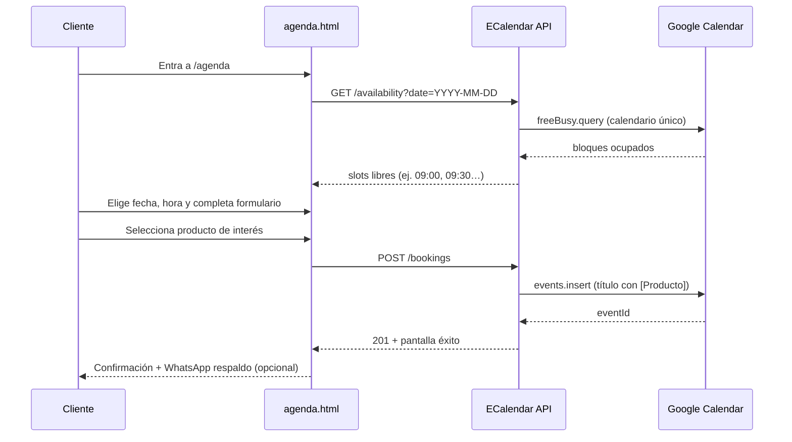

# Propuesta técnica — ECalendar V1

**Producto:** ECalendar V1 — Agenda única EasyTech  
**Versión:** 1.0 — propuesta previa a implementación  
**Fecha:** junio 2026  
**Sitio:** easytech.services → slug único `/agenda` (`agenda.html` en estático)  
**Estado:** **sin programar** — documento para validación

---

## Resumen ejecutivo

ECalendar V1 reemplaza **Calendly** por una agenda propia EasyTech con **un solo Google Calendar** y **una sola URL** (`/agenda`). La diferenciación por producto no va en rutas ni calendarios separados, sino en:

1. Campo **Producto de interés** del formulario.  
2. **Título del evento** en Google Calendar: `[Producto] Tipo con Cliente X`.

**Conclusión técnica clave:** el sitio actual es **HTML estático** sin backend. Google Calendar API **no puede** integrarse de forma segura solo desde el navegador (credenciales OAuth expuestas). V1 requiere un **servicio backend mínimo** (API proxy) además de cambios en `agenda.html`.

La propuesta es **simple, comercial y escalable**, alineada con la instrucción oficial.

---

## 1. Flujo funcional

### 1.1 Flujo del visitante (frontend)



### 1.2 Pasos UX propuestos (una página, wizard ligero)

| Paso | Acción | Notas |
|------|--------|-------|
| 1 | Elegir **fecha** | Mini-calendario; solo días con al menos un slot |
| 2 | Elegir **hora** | Botones de slots de 30 min (configurable) |
| 3 | Completar **datos + producto** | Formulario en la misma página |
| 4 | **Confirmar** | POST al backend |
| 5 | **Éxito** | Resumen + enlace WhatsApp prellenado por producto |

**Pre-selección de producto (V1 permitido):** query string en la misma URL, sin slugs nuevos:

```text
/agenda?product=easy-odoo
/agenda?product=facturacion-electronica
```

El `<select>` llega prellenado; **no** se crean `/agenda/easy-odoo`, etc.

### 1.3 Flujo interno (equipo EasyTech)

```text
Todos los leads → un Google Calendar
        ↓
Filtrar por prefijo en título: [Easy Odoo], [Facturación Electrónica], …
        ↓
Vista semanal / móvil Google Calendar
        ↓
(Futuro V2) webhook → CRM / EN1
```

### 1.4 Formato de evento en Google Calendar

| Campo GCal | Valor ejemplo |
|------------|---------------|
| **summary** | `[Easy Odoo] Demo con Juan Pérez` |
| **description** | Empresa, WhatsApp, email, comentario, slug producto, booking_id |
| **start / end** | ISO 8601, timezone `America/Panama` |
| **attendees** | email del cliente (invitación automática si se usa) |
| **reminders** | Default del calendario o popup 30 min |

**Tipos de título sugeridos** (mismo calendario, distinto copy):

```text
[Easy Odoo] Demo con {Nombre}
[Facturación Electrónica] Consulta con {Nombre}
[Easy Converso] Demo con {Nombre}
[EasyNodeOne / EN1] Demo con {Nombre}
…
```

### 1.5 Catálogo de productos (formulario)

Lista cerrada en backend + frontend (misma fuente):

| slug (interno) | Etiqueta en formulario |
|----------------|------------------------|
| `easy-odoo` | Easy Odoo |
| `facturacion-electronica` | Facturación Electrónica Panamá |
| `easy-converso` | Easy Converso |
| `easynodeone` | EasyNodeOne / EN1 |
| `eclassone` | EClassOne |
| `ethesisone` | EThesisOne |
| `eposone` | EPOSOne |
| `epayroll` | EPayRoll |
| `iius` | IIUS |
| `consultoria-ti` | Consultoría TI |
| `desarrollo-software` | Desarrollo de Software |

---

## 2. Requerimientos Google OAuth / API

### 2.1 Enfoque recomendado para V1

**OAuth 2.0 con refresh token** de la cuenta Google oficial EasyTech:

| Campo | Valor aprobado |
|-------|----------------|
| **Cuenta Google (calendario único)** | `easytechservices25@gmail.com` |
| **Correo público / contacto** | `easytechservices25@gmail.com` |
| **Calendly actual (transición)** | `calendly.com/easytechservices25/30min` — misma cuenta |

| Aspecto | Detalle |
|---------|---------|
| Proyecto | Google Cloud Console — proyecto `easytech-ecalendar` |
| APIs habilitadas | Google Calendar API |
| Tipo de credencial | OAuth client **Web** (backend) + flujo one-time para obtener refresh token |
| Alcance mínimo | `https://www.googleapis.com/auth/calendar.events` |
| Calendario | **Uno** — ID del calendario primario o calendario dedicado “EasyTech Citas” |
| Secreto | `GOOGLE_CLIENT_ID`, `GOOGLE_CLIENT_SECRET`, `GOOGLE_REFRESH_TOKEN` — **solo servidor** |

**Alternativa rápida (MVP interno):** Google Apps Script desplegado como Web App con `doGet`/`doPost`. Menos infraestructura, límites de Apps Script, aceptable para V1 piloto.

**No recomendado V1:** Service Account sin delegación — complica invitaciones a clientes externos.

### 2.2 Setup operativo (checklist negocio)

1. Crear o elegir cuenta Google propietaria del calendario único.  
2. Definir horario laboral en Google Calendar (Working hours).  
3. Bloquear manualmente almuerzos / feriados Panamá en el mismo calendario.  
4. Ejecutar flujo OAuth una vez; guardar refresh token en secretos del hosting.  
5. Verificar que eventos de prueba aparecen con título `[Producto] …`.

### 2.3 Permisos y seguridad

- El frontend **nunca** recibe refresh token ni client secret.  
- API expone solo:
  - `GET /api/ecalendar/availability`
  - `POST /api/ecalendar/bookings`
  - `GET /api/ecalendar/products` (opcional, lista del formulario)
- Rate limiting por IP (ej. 30 req/min).  
- CAPTCHA opcional V1.1 si hay spam (reCAPTCHA v3).

---

## 3. Manejo de disponibilidad

### 3.1 Reglas V1 (configuración estática en backend)

```yaml
timezone: America/Panama
slot_duration_minutes: 30
slot_step_minutes: 30
lead_time_hours: 4          # no reservar con menos de 4 h de anticipación
horizon_days: 30            # máximo 30 días adelante
working_hours:
  mon-fri: ["09:00", "17:00"]
  sat-sun: []               # cerrado
buffer_minutes: 0           # V1 sin buffer entre citas
```

### 3.2 Algoritmo

```text
1. Generar todos los slots del día según working_hours y slot_duration.
2. Llamar calendar.freebusy.query para el calendar_id único en ese rango.
3. Restar intervalos busy (eventos existentes + bloqueos manuales).
4. Aplicar lead_time y horizon.
5. Devolver lista ["09:00", "09:30", …] en JSON.
```

### 3.3 Fuente de verdad

| Dato | Fuente |
|------|--------|
| Ocupado / libre | Google Calendar (único) |
| Reglas de negocio | Config backend `ecalendar.config.json` |
| Reservas confirmadas | Evento creado en GCal |

### 3.4 Concurrencia (doble reserva)

**Riesgo:** dos clientes eligen el mismo slot simultáneamente.

**Mitigación V1:**

1. Al `POST /bookings`, re-verificar freebusy del slot exacto.  
2. Si ocupado → `409 Conflict` → UI pide otra hora.  
3. (Opcional V1.1) lock optimista con TTL 2 min en memoria/Redis.

Calendly resolvía esto nativamente; ECalendar debe implementarlo explícitamente.

### 3.5 Zona horaria

- Backend siempre trabaja en `America/Panama`.  
- Frontend muestra hora local Panamá (sin selector TZ en V1).  
- Eventos GCal con `timeZone: "America/Panama"`.

---

## 4. Modelo de datos mínimo

V1 **no requiere CRM ni base de datos obligatoria** — Google Calendar es el registro principal.

### 4.1 Payload de reserva (API)

```json
{
  "product_slug": "easy-odoo",
  "start_at": "2026-06-15T14:00:00-05:00",
  "client": {
    "full_name": "Juan Pérez",
    "company": "Empresa SA",
    "whatsapp": "+50760000000",
    "email": "juan@empresa.com",
    "notes": "Quiero ver inventario y facturación"
  }
}
```

### 4.2 Respuesta exitosa

```json
{
  "booking_id": "550e8400-e29b-41d4-a716-446655440000",
  "google_event_id": "abc123google",
  "google_event_link": "https://calendar.google.com/...",
  "title": "[Easy Odoo] Demo con Juan Pérez",
  "start_at": "2026-06-15T14:00:00-05:00",
  "end_at": "2026-06-15T14:30:00-05:00"
}
```

### 4.3 Log local opcional (recomendado)

Tabla o JSONL mínimo para auditoría y soporte:

| Campo | Tipo | Uso |
|-------|------|-----|
| `booking_id` | UUID | Referencia soporte |
| `created_at` | datetime | Auditoría |
| `product_slug` | string | Filtro |
| `product_label` | string | Display |
| `start_at` / `end_at` | datetime | — |
| `google_event_id` | string | Sync / cancelación futura |
| `client_*` | strings | Backup si GCal falla |
| `ip_hash` | string | Anti-abuso |

**Almacenamiento V1:** SQLite en el mismo servicio, o solo log en Cloud Logging. No CRM.

### 4.4 Confirmación al cliente

| Canal | V1 | Implementación |
|-------|-----|----------------|
| Pantalla éxito | ✅ Obligatorio | HTML estático post-POST |
| Google Calendar invite | ✅ Recomendado | `attendees: [{ email }]` en `events.insert` |
| Email propio SMTP | ⚠ Opcional | Si invite GCal no basta |
| WhatsApp respaldo | ✅ Obligatorio | Link `wa.me` prellenado con producto y fecha |

---

## 5. Archivos a modificar / crear

### 5.1 Sitio estático (repo actual)

| Archivo | Acción |
|---------|--------|
| `agenda.html` | **Reemplazar** shell Calendly por UI ECalendar (wizard + formulario) |
| `assets/js/ecalendar.js` | **Crear** — fetch availability, submit booking, prefill `?product=` |
| `assets/js/ecalendar-products.js` | **Crear** — catálogo 11 productos (labels + slugs + WhatsApp templates) |
| `assets/css/main.css` / `ramp-theme.css` | **Extender** estilos `.schedule-*` para formulario propio |
| `assets/js/main.js` | **Eliminar** bloque `initScheduleEmbed` / Calendly (~líneas 51–210) |
| `assets/js/calendly-config.js` | **Deprecar / eliminar** |
| `assets/js/portal-urls.js` | Quitar `calendly`; agregar `ecalendarApiBase` |
| `docs/MAPA_CTA.md` | Actualizar canal Agenda (post-aprobación) |
| `docs/ROADMAP_*` | Nota: fin de Calendly |

**No cambiar en V1:** header, footer, resto de páginas (siguen enlazando `agenda.html`).

### 5.2 Backend nuevo (fuera del HTML estático)

Propuesta de ubicación — **elegir una**:

| Opción | Pros | Contras |
|--------|------|---------|
| **A. Cloudflare Worker + KV** | Barato, edge, secrets | Lógica acotada |
| **B. Vercel/Netlify serverless** | Deploy simple | Cold starts |
| **C. Módulo en EN1** (`appprd.easynodeone.com`) | Misma org, futuro CRM | Dependencia EN1 |
| **D. Google Apps Script** | Cero servidor, OAuth nativo | Límites, menos control |

**Recomendación:** **C** si EN1 ya tiene backend Python/Node; si no, **A** o **D** para V1 rápido.

Estructura sugerida del servicio:

```text
ecalendar-api/
├── src/
│   ├── config.ts          # horarios, calendar_id, productos
│   ├── google-calendar.ts # freebusy + events.insert
│   ├── availability.ts    # generación de slots
│   ├── bookings.ts        # validación + creación
│   └── server.ts          # rutas HTTP
├── .env.example
└── README.md
```

### 5.3 Infraestructura / DNS

| Elemento | Valor |
|----------|-------|
| URL pública agenda | `https://easytech.services/agenda` |
| API | `https://easytech.services/api/ecalendar/*` o subdominio `api.easytech.services` |
| CORS | Solo origen `easytech.services` |

En hosting estático: reglas rewrite `/agenda` → `agenda.html`; proxy `/api/ecalendar` → backend.

---

## 6. Riesgos

| # | Riesgo | Impacto | Mitigación |
|---|--------|---------|------------|
| 1 | Sitio estático sin backend | **Bloqueante** | API proxy obligatoria; no integrar GCal desde browser |
| 2 | Doble reserva concurrente | Medio | Re-check freebusy antes de insert; 409 al conflicto |
| 3 | Token OAuth revocado | Alto | Monitoreo + alerta; documentar re-auth anual |
| 4 | Spam / bots en formulario | Medio | Rate limit; CAPTCHA V1.1 |
| 5 | Sin CRM — solo GCal | Bajo (aceptado V1) | Títulos `[Producto]` + description estructurada |
| 6 | Cancelación / reprogramación | Medio | V1: manual por WhatsApp/email; V2 enlace cancel |
| 7 | Meet / Zoom link | Bajo | V1: sin videollamada auto; V2 Google Meet en evento |
| 8 | Conflicto con doc previo “sin formularios HTML” | Proceso | **Aprobación explícita** — ECalendar supersede esa restricción para `/agenda` |
| 9 | IIUS / productos sin página | Bajo | Solo entrada en select; no requiere slug |
| 10 | Migración desde Calendly | Medio | Período paralelo 1–2 semanas; luego desactivar embed |

---

## 7. Estimación

### 7.1 Desglose (1 desarrollador familiarizado con el repo)

| Fase | Entregable | Días |
|------|------------|------|
| **0. Aprobación** | Validar backend target (EN1 vs Worker vs Apps Script) | 0.5 |
| **1. Google Cloud** | Proyecto, OAuth, calendario único, prueba manual evento | 0.5–1 |
| **2. API** | availability + bookings + validación + errores | 1.5–2 |
| **3. Frontend** | `agenda.html` + `ecalendar.js` + estilos + éxito/error | 1.5–2 |
| **4. Integración** | CORS, deploy, env prod, quitar Calendly | 0.5–1 |
| **5. QA** | TZ, conflictos, 11 productos, móvil, fallback WA | 1 |
| **6. Docs** | MAPA_CTA, runbook OAuth, operación filtros GCal | 0.5 |

**Total estimado:** **5.5 – 8 días hábiles**

### 7.2 MVP reducido (si hay prisa)

| Incluye | Excluye | Días |
|---------|---------|------|
| Apps Script + formulario simple + crear evento | Log DB, CAPTCHA, email custom | **2–3** |

### 7.3 Fuera de alcance V1 (explícito)

- Múltiples calendarios o `/agenda/{producto}`  
- CRM, EN1 sync, IA  
- Pagos, aprobación manual workflow  
- Recordatorios SMS  
- Admin panel EasyTech  

---

## 8. Comparativa: Calendly hoy vs ECalendar V1

| Criterio | Calendly (actual) | ECalendar V1 |
|----------|-------------------|--------------|
| Calendarios | 1 event type | 1 Google Calendar |
| Producto | No en formulario estándar | **Select 11 productos** |
| Título evento | Genérico | **`[Producto] …`** |
| Dependencia externa | Calendly SaaS | Google Calendar |
| Costo | Plan Calendly | GCal API gratis en uso normal |
| Control datos | Calendly | Google + log propio opcional |
| Implementación | iframe embebido | Formulario propio + API |
| Alineación ecosistema | Parcial | **Total** (misma vía, filtro por producto) |

---

## 9. Decisión requerida antes de programar

| # | Pregunta | Decisión |
|---|----------|----------|
| 1 | ¿Dónde vive el backend? | ✅ **EN1** — appdev → appprd (ver `INSTRUCCION_ECALENDAR_EN1_APPDEV.md`) |
| 2 | ¿Cuenta Google del calendario único? | ✅ **`easytechservices25@gmail.com`** (aprobado jun 2026) |
| 3 | ¿Duración fija 30 min para todos los productos? | Sí V1 · No (config por producto V2) — **pendiente** |
| 4 | ¿Invitación GCal al email del cliente? | Sí (recomendado) · No — **pendiente** |
| 5 | ¿Apagar Calendly de inmediato o transición? | Big bang · paralelo 2 semanas — **pendiente** |
| 6 | ¿Log de bookings además de GCal? | Sí SQLite · No V1 — **pendiente** |

---

## 10. Alineación con instrucción oficial

| Requisito | Cubierto |
|-----------|----------|
| Un solo calendario Google | ✅ |
| Un solo slug `/agenda` | ✅ (`agenda.html` + rewrite) |
| Producto en formulario, no en URL | ✅ (+ `?product=` opcional) |
| Título con producto | ✅ |
| 11 productos listados | ✅ |
| Sin Calendly / iframe | ✅ (retirar en implementación) |
| Sin CRM / IA / rediseño sitio | ✅ |
| Confirmación + WhatsApp respaldo | ✅ |
| Propuesta técnica previa | ✅ este documento |

---

**Próximo paso:** validar §9 (backend target + cuenta Google) → aprobar estimación → Sprint ECalendar V1.

**Referencias:** `agenda.html`, `assets/js/calendly-config.js`, `assets/js/main.js` (initScheduleEmbed), `docs/MAPA_CTA.md`, `docs/PROPUESTA_ALINEACION_ECOSYSTEM.md` §6 (Calendly).
